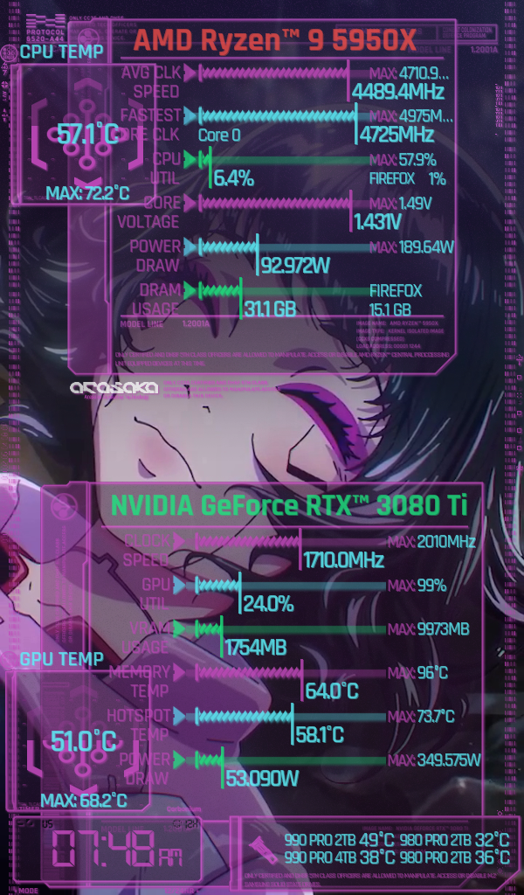

# SensorPanelCyberpunk

 <!-- Add path to your preview image -->

SensorPanelCyberpunk is a customizable sensor panel created for Rainmeter that displays system sensor information using HWiNFO. It features a sleek cyberpunk-inspired design that integrates real-time data visualization for temperatures, usage, and other hardware metrics. Release version will not have potential copyright images

With support for different sensors, users can fully customize the panel to display the information they care about most, from CPU temperatures to GPU loads. The design uses modern, futuristic fonts to deliver a highly aesthetic look while maintaining practicality.

## Features

- Displays real-time system information using HWiNFO and Rainmeter.
- Fully customizable to display any sensor information from HWiNFO (CPU, GPU, RAM, etc.).
- Cyberpunk-inspired design with a clean, modern interface.
- Easy-to-use configuration and customization options.
- Designed for 1024x600 monitor in portrait mode.
- Uses fonts that complement the cyberpunk style.

## Requirements

1. **Rainmeter** - [Download Rainmeter](https://www.rainmeter.net/)
2. **HWiNFO** - [Download HWiNFO](https://www.hwinfo.com/)
3. **Fonts**:
   - [DS-Digital Font](https://www.dafont.com/ds-digital.font) - Used for the digital clock and numeric displays.
   - [Rajdhani Font](https://github.com/itfoundry/rajdhani) - Used for text elements and labels within the panel.
  
Make sure to install these fonts to get the intended visual style!

## Installation

1. **Install Rainmeter**:
   - Download and install Rainmeter from the [official website](https://www.rainmeter.net/).

2. **Install HWiNFO**:
   - Download and install HWiNFO from the [official website](https://www.hwinfo.com/).
   - Configure HWiNFO to allow Rainmeter to access sensor data by enabling "Shared Memory Support" in HWiNFO settings.  
   For more information on how to set up HWiNFO with Rainmeter, refer to the [HWiNFO Rainmeter documentation](https://docs.rainmeter.net/tips/hwinfo/).

3. **Clone or Download the Project**:
   - Clone the repository:  
     ```bash
     git clone https://github.com/DevChrisL/SensorPanelCyberpunk.git
     ```
   - Or download the latest release from the [releases page](#).

4. **Install Fonts**:
   - Download and install the [DS-Digital Font](https://www.dafont.com/ds-digital.font).
   - Download and install the [Rajdhani Font](https://github.com/itfoundry/rajdhani).

5. **Apply the Skin**:
   - Open Rainmeter, click the Rainmeter icon in the system tray.
   - Select "Manage" and navigate to the folder where you downloaded the skin.
   - Load the skin, and customize it based on your preferences using the Rainmeter settings.

6. **Configure Sensors**:
   - Open HWiNFO and Rainmeter to ensure that the appropriate sensors are linked to the corresponding Rainmeter skins.
   - Customize which sensors you want displayed by editing the `.ini` files in Rainmeter.

## Customization

- **Set Sensor Information**: In the Rainmeter skin `.ini` files, sensor data is mapped using specific variables like `CPUSensor0`, `CPUSensor0Name`, `CPUSensor0Measurement`, `CPUSensor0MinValue`, and `CPUSensor0MaxValue`. 

   To customize the sensor values, locate the **Variables** section in the `.ini` file and adjust the parameters based on your needs. For example:

   ```ini
   [Variables]
   ; CPU Sensor 0
   CPUSensor0=53
   CPUSensor0Name=CPU TEMP
   CPUSensor0Measurement=°C
   CPUSensor0MinValue=0
   CPUSensor0MaxValue=100

   ; GPU Sensor 0
   GPUSensor0=67
   GPUSensor0Name=GPU LOAD
   GPUSensor0Measurement=%
   GPUSensor0MinValue=0
   GPUSensor0MaxValue=100
   ```

   - **CPUSensor0** refers to the specific HWiNFO sensor ID for CPU temperature.
   - **CPUSensor0Name** defines the label for the sensor (e.g., "CPU TEMP").
   - **CPUSensor0Measurement** is the unit of measurement (e.g., "°C").
   - **CPUSensor0MinValue** and **CPUSensor0MaxValue** define the range for the sensor readings.

   **Make sure to read the comments in the `.ini` files** for detailed explanations on how to correctly set these variables and ensure that the displayed data matches your system's sensors.

- **Font Settings**: You can change the font size, style, and other properties by editing the `.ini` file for each section of the panel.
- **Panel Layout**: Feel free to rearrange, resize, or add new elements to suit your monitor and aesthetic preferences.

## License

This project is licensed under the [Creative Commons BY-ND 4.0](https://creativecommons.org/licenses/by-nd/4.0/).

## Acknowledgments

* [HWiNFO Rainmeter documentation](https://docs.rainmeter.net/tips/hwinfo/)
* [Rainmeter documentation for measures, meters and more](https://docs.rainmeter.net/manual/)
* [Rajdhani font designed by itfoundry](https://github.com/itfoundry/rajdhani?tab=readme-ov-file)
* [DS-Digital font designed by Dusit Supasawat](https://www.dafont.com/font-comment.php?file=ds_digital)
